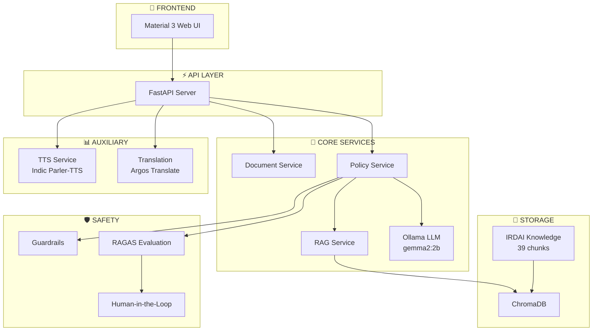

# SaralPolicy - Local AI Insurance Analysis


**Tagline:** *"Insurance ka fine print, ab saaf saaf."*

**Status:** 🟢 POC/Demo (Remediation Complete) | **Progress:** 26/26 Issues Resolved (100%) | [View Status](docs/STATUS.md) | [Implementation Report](docs/reports/IMPLEMENTATION_STATUS.md)

<div align="center">

[](https://opensource.org/licenses/MIT)
[](https://www.python.org/downloads/)
[](backend/tests/)
[](CONTRIBUTING.md)
[](https://peps.python.org/pep-0008/)

[](https://fastapi.tiangolo.com/)
[](https://ollama.ai/)
[](https://www.trychroma.com/)
[](https://docs.pydantic.dev/)
[](https://www.sqlalchemy.org/)

[](https://github.com/explodinggradients/ragas)
[](https://opentelemetry.io/)
[](https://github.com/coleifer/huey)
[](https://huggingface.co/ai4bharat/indic-parler-tts)

### 🛠️ Tech Stack


### 🔧 OSS Frameworks

| Framework | Purpose | License | Stars |
|-----------|---------|---------|-------|
|  | RAG Evaluation (Faithfulness, Relevancy) | Apache 2.0 | 7k+ |
|  | Metrics, Tracing, Observability | Apache 2.0 | 1.5k+ |
|  | Background Task Queue (SQLite backend) | MIT | 5k+ |
|  | High-Quality Hindi Neural TTS (0.9B params) | Apache 2.0 | AI4Bharat |

</div>

---

## 🎯 What is SaralPolicy?

An AI-powered insurance document analysis system (POC/Demo) that uses local AI models to provide clear, easy-to-understand summaries in Hindi and English, with comprehensive guardrails and human-in-the-loop validation. **All processing happens locally for complete privacy.**

**Status:** 🟡 POC/Demo - See [Status](docs/STATUS.md) and [Production Engineering Evaluation](docs/reports/PRODUCTION_ENGINEERING_EVALUATION.md) for details.

---

## 🖼️ Application Screenshots

<div align="center">

### Main Interface

*Beautiful Material 3 design with drag & drop document upload*


*Real-time policy analysis with AI-powered insights*

### RAG Indexing & Knowledge Base

*IRDAI knowledge base indexing with ChromaDB*


*Hybrid search combining BM25 + Vector embeddings*

### Policy Analysis Features

*Comprehensive policy breakdown with key terms*


*Coverage details and exclusion highlights*

### Exclusion Detection

*AI-powered exclusion identification with IRDAI citations*

</div>

---

## ✨ Core Features

### 🚀 Performance & Processing
- **⚡ Optimized Document Parsing:** Parallel PDF processing with ThreadPoolExecutor (4 workers)
- **📦 Smart Caching:** Document and embedding caching with MD5 hashing
- **🔄 Batch Operations:** Parallel embedding generation for faster RAG indexing
- **📊 Performance Monitoring:** Real-time metrics tracking for all operations

### 🤖 AI & Intelligence
- **🤖 Local AI Analysis:** Ollama + Gemma 2 2B model running locally for privacy
- **🧠 RAG-Enhanced:** Retrieval-Augmented Generation with IRDAI knowledge base (39 chunks)
- **🔍 Hybrid Search:** BM25 (keyword) + Vector (semantic) search with query caching
- **📤 Advanced Embeddings:** nomic-embed-text (274MB) with connection pooling

### 🛡️ Safety & Quality
- **🔒 Advanced Guardrails:** Input validation, PII protection, and safety checks
- **👥 Human-in-the-Loop:** Expert review for low-confidence analyses
- **📊 RAGAS Evaluation:** Faithfulness, relevancy, precision metrics (Apache 2.0)

### 📄 Document Processing
- **📁 Multi-Format Support:** PDF, DOCX, and TXT files with drag & drop
- **🔑 Key Insights:** Coverage details, exclusions, and important terms
- **❓ Interactive Q&A:** Document-specific Q&A with IRDAI augmentation

### 🎨 User Experience
- **🎨 Modern UI:** Beautiful Material 3 design with responsive layout
- **🌐 Bilingual:** Results in both Hindi and English
- **📊 Text-to-Speech:** High-quality Hindi neural TTS (Indic Parler-TTS)
- **🔒 100% Privacy:** Complete local processing, no data leaves your machine

---

## 🚀 Quick Start

### Prerequisites
- **OS:** Windows, Linux, or macOS
- **Python:** 3.9 or higher
- **RAM:** Minimum 8GB (16GB recommended)
- **Disk Space:** ~10GB (for models and virtual environment)

### 1. Setup Environment
```bash
# Clone the repository
git clone https://github.com/VIKAS9793/SaralPolicy.git
cd SaralPolicy

# Create virtual environment
python -m venv venv
venv\Scripts\activate  # Windows
# source venv/bin/activate  # Linux/Mac

# Upgrade pip
python -m pip install --upgrade pip
```

### 2. Install Dependencies
```bash
cd backend
pip install -r requirements.txt
```

### 3. Install and Setup Ollama
```bash
# Download and install Ollama from https://ollama.ai/download
# Pull required models
ollama pull gemma2:2b
ollama pull nomic-embed-text

# Start Ollama service (keep running in background)
ollama serve
```

### 4. Environment Configuration
```bash
# Copy environment template
copy .env.example .env  # Windows
# cp .env.example .env  # Linux/Mac

# Edit .env and add your HuggingFace token (optional, for Indic Parler-TTS)
# HF_TOKEN=hf_your_token_here
```

### 5. Index IRDAI Knowledge Base
```bash
python scripts/index_irdai_knowledge.py
```

### 6. Run the Application
```bash
python main.py
```

### 7. Open in Browser
Visit **http://localhost:8000** to access the Material 3 web interface.

---

## 📁 Project Structure
```
SaralPolicy/
├── backend/
│   ├── main.py                          # Main FastAPI application
│   ├── requirements.txt                 # All dependencies (pinned versions)
│   ├── .env.example                     # Environment template (safe to commit)
│   ├── .env                             # Your secrets (NEVER commit)
│   ├── app/
│   │   ├── config.py                    # Validated configuration (Pydantic)
│   │   ├── dependencies.py              # Dependency Injection Container
│   │   ├── routes/                      # API Endpoints
│   │   ├── services/                    # Business Logic Services
│   │   │   ├── ollama_llm_service.py    # Local LLM via Ollama
│   │   │   ├── rag_service.py           # RAG with ChromaDB
│   │   │   ├── policy_service.py        # Policy analysis orchestration
│   │   │   ├── guardrails_service.py    # Input/output validation
│   │   │   ├── tts_service.py           # Text-to-speech orchestration
│   │   │   ├── indic_parler_engine.py   # Hindi neural TTS (Apache 2.0)
│   │   │   ├── rag_evaluation_service.py    # RAGAS evaluation
│   │   │   ├── observability_service.py     # OpenTelemetry metrics
│   │   │   └── task_queue_service.py        # Huey task queue
│   │   ├── middleware/                  # Security middleware
│   │   ├── prompts/                     # Versioned prompt registry
│   │   ├── models/                      # Data models
│   │   └── db/                          # Database layer
│   ├── tests/                           # All tests (197 passing)
│   ├── data/
│   │   ├── chroma/                      # ChromaDB persistent storage
│   │   └── irdai_knowledge/             # IRDAI regulatory documents
│   ├── scripts/                         # Utility scripts
│   ├── static/                          # Frontend assets (CSS, JS)
│   └── templates/                       # HTML templates
├── docs/
│   ├── SETUP.md                         # Installation guide
│   ├── TROUBLESHOOTING.md               # Common issues & solutions
│   ├── SYSTEM_ARCHITECTURE.md           # Detailed architecture
│   ├── STATUS.md                        # Current status
│   ├── setup/                           # Additional setup guides
│   ├── reports/                         # Technical reports
│   ├── adr/                             # Architectural decisions
│   └── product-research/                # Strategic documents (16 docs)
├── assets/                              # Screenshots and banners
├── .gitignore                           # Git ignore (includes .kiro/, .env)
├── README.md                            # This file
├── CONTRIBUTING.md                      # Contribution guidelines
└── LICENSE                              # MIT License
```

---

## 🔧 Technical Details

### Core Infrastructure
| Component | Technology | Version |
|-----------|------------|---------|
| Backend | FastAPI | 0.115.6 |
| AI Model | Ollama + Gemma 2 2B | Local |
| Embeddings | nomic-embed-text | 274MB |
| Vector DB | ChromaDB | 0.5.23 |
| Validation | Pydantic | 2.10.3 |
| Database | SQLAlchemy + SQLite | 2.0.36 |
| UI | Material Design 3 | HTML/CSS/JS |

### OSS Frameworks (No API Keys Required)
| Framework | Purpose | License | Fallback |
|-----------|---------|---------|----------|
| **RAGAS** | RAG evaluation (faithfulness, relevancy) | Apache 2.0 | Heuristic scoring |
| **OpenTelemetry** | Metrics, tracing, observability | Apache 2.0 | Built-in metrics |
| **Huey** | Background task queue (SQLite backend) | MIT | Synchronous execution |
| **Indic Parler-TTS** | High-quality Hindi neural TTS (0.9B params) | Apache 2.0 | gTTS → pyttsx3 |

### Text-to-Speech Performance
| Hardware | ~100 chars | ~500 chars |
|----------|-----------|-----------|
| CPU (default) | 2-5 min | 5-10 min |
| GPU (CUDA) | 5-15 sec | 15-45 sec |
| GPU (Apple M1/M2) | 10-30 sec | 30-90 sec |

> **Note:** Neural TTS on CPU is slow but produces high-quality Hindi speech. For faster responses, the system falls back to gTTS automatically.

---

## 🏗️ System Architecture



> **📖 Full Architecture:** See [SYSTEM_ARCHITECTURE.md](docs/SYSTEM_ARCHITECTURE.md)

---

## 🧪 Testing

```bash
cd backend

# Run all tests (197 tests)
python -m pytest tests/ -v

# Run specific test categories
python -m pytest tests/test_security.py -v          # Security tests
python -m pytest tests/test_oss_frameworks.py -v    # OSS framework tests
python -m pytest tests/test_hallucination_detection.py -v  # Hallucination tests

# Run with coverage
python -m pytest tests/ --cov=app --cov-report=html
```

### Test Categories
| Category | Tests | Description |
|----------|-------|-------------|
| Configuration | 23 | Config validation, environment handling |
| Security | 15 | Input sanitization, PII protection, CORS |
| Error Paths | 23 | Graceful degradation, fallback handling |
| Hallucination | 15 | Detection accuracy, grounding validation |
| OSS Frameworks | 28 | RAGAS, OpenTelemetry, Huey integration |
| Integration | 20+ | End-to-end workflow tests |
| **Total** | **197** | **All passing** |

---

## 🔒 Privacy & Security

- **100% Local Processing:** All AI analysis happens on your machine
- **No Cloud APIs:** Zero data sent to external services
- **No API Keys Required:** Core functionality works offline
- **Advanced Guardrails:** Input validation, PII protection, safety checks
- **HITL Validation:** Expert review for quality assurance
- **Secure Secrets:** `.env` file in `.gitignore`, never committed

### Environment Variables
```bash
# backend/.env (NEVER commit this file)
HF_TOKEN=hf_your_token_here  # Optional: For Indic Parler-TTS
OLLAMA_HOST=localhost:11434  # Default Ollama endpoint
```

---

## 📚 Documentation

### Quick Links
- **[Changelog](CHANGELOG.md)** - Version history and release notes
- **[Setup Guide](docs/SETUP.md)** - Installation and configuration
- **[Troubleshooting](docs/TROUBLESHOOTING.md)** - Common issues and solutions
- **[System Architecture](docs/SYSTEM_ARCHITECTURE.md)** - Technical deep-dive
- **[Status](docs/STATUS.md)** - Current project status
- **[Ollama Setup](docs/setup/OLLAMA_SETUP.md)** - Local AI model setup

### Product Research (16 Documents)
| # | Document | Description |
|---|----------|-------------|
| 1 | [Executive Summary](docs/product-research/01-executive-summary.md) | Problem, solution, market opportunity (₹1,200 Cr) |
| 2 | [Product Vision](docs/product-research/02-product-vision-strategy.md) | Long-term vision and strategy |
| 3 | [Business Case](docs/product-research/03-business-case-market-validation.md) | Market sizing (515M policies), revenue models |
| 4 | [Competitive Analysis](docs/product-research/04-competitive-framework-analysis.md) | Competitor landscape, differentiation |
| 5 | [Product Roadmap](docs/product-research/05-product-roadmap.md) | Feature timeline, milestones |
| 6 | [PRD](docs/product-research/06-product-requirements-document.md) | Functional requirements, user stories |
| 7 | [Requirements](docs/product-research/07-functional-non-functional-requirements.md) | Technical specifications |
| 8 | [Architecture](docs/product-research/08-system-data-architecture.md) | System design, data flow |
| 9 | [Explainability](docs/product-research/09-explainability-evals-framework.md) | AI transparency, evaluation metrics |
| 10 | [User Journey](docs/product-research/10-user-journey-experience-maps.md) | UX flows, interaction design |
| 11 | [Privacy & Compliance](docs/product-research/11-data-privacy-compliance-plan.md) | IRDAI, DPDP Act 2023 |
| 12 | [Testing Strategy](docs/product-research/12-testing-quality-assurance-strategy.md) | QA plans, coverage |
| 13 | [Go-to-Market](docs/product-research/13-go-to-market-strategy.md) | Launch plan, pricing |
| 14 | [Risk Register](docs/product-research/14-risk-mitigation-register.md) | Risk identification, mitigation |
| 15 | [Ethical AI](docs/product-research/15-ethical-ai-governance-report.md) | AI ethics, bias mitigation |
| 16 | [Metrics & KPIs](docs/product-research/16-metrics-kpi-framework.md) | Success metrics, North Star |

---

## 📊 API Endpoints

| Endpoint | Method | Purpose |
|----------|--------|---------|
| `/` | GET | Serve frontend UI |
| `/upload` | POST | Upload policy document |
| `/analyze` | POST | Analyze uploaded policy |
| `/rag/ask` | POST | Ask question via RAG |
| `/rag/stats` | GET | RAG service statistics |
| `/tts` | POST | Generate audio summary |
| `/translate` | POST | Hindi ↔ English translation |

---

## 🎯 POC Goals

- **Validate Core Concept:** Does local AI analysis provide value?
- **Test Accuracy:** Are summaries and insights accurate?
- **User Experience:** Is the Material 3 interface intuitive?
- **Guardrails Effectiveness:** Are safety checks working?
- **HITL Integration:** How often is expert review needed?
- **Market Fit:** Is there demand for privacy-first insurance analysis?

---

## 👤 Author

**Vikas Sahani**  
*Product Manager & Main Product Lead*

- 📧 Email: [vikassahani17@gmail.com](mailto:vikassahani17@gmail.com)
- 💼 LinkedIn: [linkedin.com/in/vikas-sahani-727420358](https://www.linkedin.com/in/vikas-sahani-727420358)
- 🐙 GitHub: [@VIKAS9793](https://github.com/VIKAS9793)

**Engineering Team:**
- **Kiro** (AI Co-Engineering Assistant)
- **Antigravity** (AI Co-Assistant & Engineering Support)

---

## 🤝 Contributing

Contributions are welcome! Please read [CONTRIBUTING.md](CONTRIBUTING.md) before submitting.

```bash
# Quick start for contributors
git checkout -b feature/AmazingFeature
git commit -m 'feat: add AmazingFeature'
git push origin feature/AmazingFeature
# Open a Pull Request
```

---

## 📄 License

This project is licensed under the **MIT License** - see [LICENSE](LICENSE) for details.

---

## 🙏 Acknowledgments

- **IRDAI** for insurance regulatory guidelines
- **Ollama** for local LLM infrastructure
- **Google** for Gemma models
- **ChromaDB** for vector database
- **FastAPI** community for excellent framework
- **AI4Bharat** for Indic Parler-TTS Hindi speech synthesis
- **HuggingFace** for model hosting and transformers library

---

## 📚 Citations

If you use SaralPolicy or its components in your research, please cite:

### Indic Parler-TTS (Hindi Text-to-Speech)

```bibtex
@inproceedings{sankar25_interspeech,
  title     = {{Rasmalai : Resources for Adaptive Speech Modeling in IndiAn Languages with Accents and Intonations}},
  author    = {Ashwin Sankar and Yoach Lacombe and Sherry Thomas and Praveen {Srinivasa Varadhan} and Sanchit Gandhi and Mitesh M. Khapra},
  year      = {2025},
  booktitle = {{Interspeech 2025}},
  pages     = {4128--4132},
  doi       = {10.21437/Interspeech.2025-2758},
}

@misc{lacombe-etal-2024-parler-tts,
  author = {Yoach Lacombe and Vaibhav Srivastav and Sanchit Gandhi},
  title = {Parler-TTS},
  year = {2024},
  publisher = {GitHub},
  howpublished = {\url{https://github.com/huggingface/parler-tts}}
}

@misc{lyth2024natural,
  title={Natural language guidance of high-fidelity text-to-speech with synthetic annotations},
  author={Dan Lyth and Simon King},
  year={2024},
  eprint={2402.01912},
  archivePrefix={arXiv},
}
```

**Model:** [ai4bharat/indic-parler-tts](https://huggingface.co/ai4bharat/indic-parler-tts) (Apache 2.0, 0.9B parameters)

---

## 📞 Support

- 📧 Email: vikassahani17@gmail.com
- 🐛 Issues: [GitHub Issues](https://github.com/VIKAS9793/SaralPolicy/issues)
- 💼 LinkedIn: [Vikas Sahani](https://www.linkedin.com/in/vikas-sahani-727420358)

**Found a security issue?** Please email vikassahani17@gmail.com instead of using the public issue tracker.

---

<p align="center">
  <b>Made with ❤️ to make insurance understandable for everyone</b>
  <br>
  <i>"Because everyone deserves to understand what they're paying for."</i>
</p>

---

*This is a POC/demo system. For production deployment, see the [Production Engineering Evaluation](docs/reports/PRODUCTION_ENGINEERING_EVALUATION.md) and [Remediation Plan](docs/reports/REMEDIATION_PLAN.md).*
